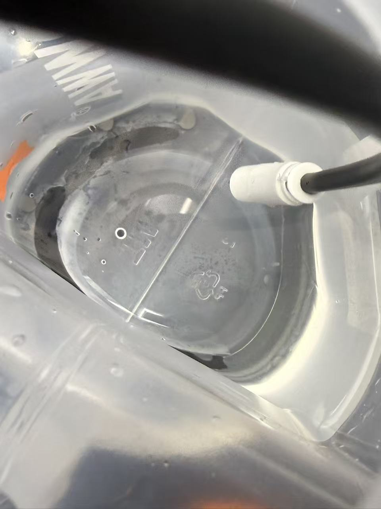
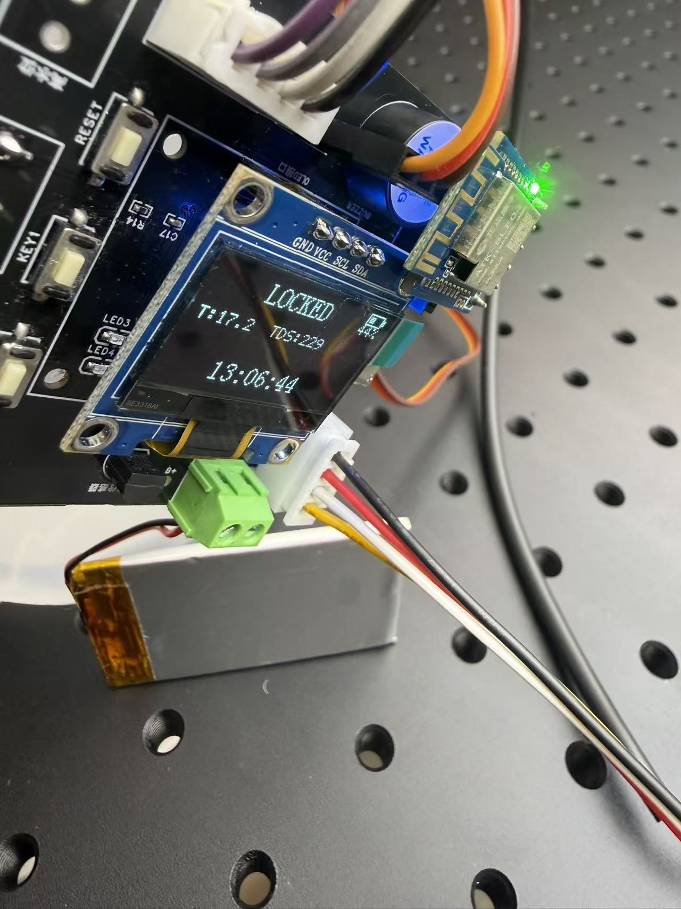
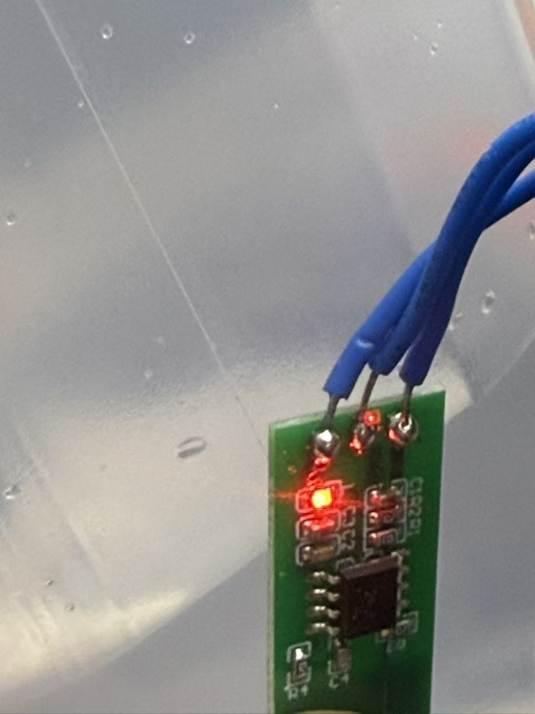

# Smart Water Bottle

基于 STM32F103C8T6 + FreeRTOS 的智能水杯系统，集成温度检测、水质分析、水位监测、密码锁、蓝牙数据传输等功能。

## 硬件平台

| 项目 | 规格 |
|------|------|
| MCU | STM32F103C8T6 (Cortex-M3, 64KB Flash, 20KB RAM) |
| 时钟 | HSI 8MHz x PLL16 / 2 = 64MHz |
| 操作系统 | FreeRTOS (heap_4, 12KB heap) |
| 工具链 | Keil MDK-ARM v5 |

## 功能特性

- **温度检测** - DS18B20 单总线温度传感器 (PA8)，精度 0.0625 C
- **水质分析** - TDS 多参数传感器 (USART3)，输出 TDS/EC/盐度/比重/硬度
- **水位监测** - M04 非接触式电容传感器，2 级检测 (PB0 低水位, PB1 高水位)
- **OLED 显示** - SSD1306 128x64 软件 I2C (PB6 SCL, PB7 SDA)，shadow buffer + dirty page 优化
- **密码锁** - SG90 舵机 (PA6 TIM3)，3 位滚动密码，3 次错误触发警报
- **红外检测** - GP2Y0A21YK0F 距离传感器 (PA1 ADC_CH1)，自动检测杯盖关闭
- **蓝牙传输** - HC-05 (USART2 9600bps)，每 2s 发送 `SWB:T=xx,TDS=xx,WL=x,HH:MM:SS`
- **电池管理** - ADC 电压检测 (PA0)，100K+100K 分压，7 级查表插值
- **实时时钟** - RTC + LSE 32.768kHz，BKP 寄存器存储日期，VBAT 掉电保持
- **蜂鸣器** - 警报/提示音 (PB5)
- **按键** - KEY1 (PA4) 解锁操作, KEY2 (PA5) 警报复位，支持短按/长按

## 项目结构

```
Smart_Water_Bottle/
├── Core/                   # HAL 系统层
│   ├── Inc/                #   FreeRTOSConfig.h, main.h, stm32f1xx_it.h
│   └── Src/                #   main.c (启动入口), stm32f1xx_it.c (中断)
├── BSP/                    # 板级支持包 (硬件驱动层)
│   ├── Inc/                #   bsp_gpio.h (引脚定义), bsp_*.h
│   └── Src/                #   14 个驱动模块
│       ├── bsp.c           #     统一初始化 + 共享 ADC1
│       ├── bsp_oled.c      #     SSD1306 I2C 驱动 (shadow buffer)
│       ├── bsp_ds18b20.c   #     OneWire 温度协议
│       ├── bsp_tds.c       #     USART3 水质查询/应答
│       ├── bsp_water_level.c #   2 级水位 GPIO 读取
│       ├── bsp_ir_sensor.c #     ADC 滑动平均滤波
│       ├── bsp_battery.c   #     ADC 查表电量计算
│       ├── bsp_servo.c     #     TIM3 PWM 舵机控制
│       ├── bsp_buzzer.c    #     蜂鸣器开关
│       ├── bsp_key.c       #     按键消抖 + 长按检测
│       ├── bsp_bluetooth.c #     HC-05 串口发送
│       ├── bsp_rtc.c       #     RTC 日历管理
│       └── bsp_gpio.c      #     GPIO 统一初始化
├── App/                    # 应用逻辑层
│   ├── Inc/                #   app_config.h (共享类型/常量)
│   └── Src/
│       ├── app_task.c      #     FreeRTOS 任务创建 + 主循环
│       ├── app_sensor.c    #     传感器数据采集 (互斥量保护)
│       ├── app_display.c   #     OLED 页面渲染
│       ├── app_lock.c      #     密码锁状态机
│       └── app_bluetooth.c #     蓝牙数据打包发送
├── Middlewares/            # FreeRTOS 内核
├── Drivers/                # STM32 HAL 库
├── MDK-ARM/                # Keil 工程文件
├── Doc/                    # 文档
│   ├── README.md           #   详细技术文档
│   └── system_flowchart.drawio  # 系统架构流程图
└── Smart_Water_Bottle.ioc  # STM32CubeMX 配置
```

## 系统架构

系统采用三层架构: **Core (HAL)** → **BSP (驱动)** → **App (业务逻辑)**

### 启动流程

```
main() → HAL_Init() → SystemClock_Config(64MHz)
       → BSP_Init() (14 个硬件模块)
       → App_Task_Create() (Mutex + Queue + 5 个任务)
       → vTaskStartScheduler()
```

### FreeRTOS 任务

| 任务 | 优先级 | 栈 (字) | 周期 | 功能 |
|------|--------|---------|------|------|
| Task_Key | 4 | 128 | 20ms | 按键扫描消抖，事件入队 |
| Task_Lock | 3 | 384 | 事件驱动 + 100ms | 锁状态机：自动锁定/密码解锁/警报 |
| Task_Sensor | 2 | 384 | 500ms | 采集温度/水质/水位/电量 |
| Task_Display | 2 | 512 | 200ms | OLED 5Hz 刷新，脏页跳过 |
| Task_Bluetooth | 1 | 384 | 2000ms | 蓝牙数据包发送 |

### 任务间通信

- `g_queue_key` - FreeRTOS 队列 (深度 5)，Key → Lock 传递按键事件
- `g_mutex_sensor` - 互斥量保护 `sensor_data_t` 共享数据
- `g_system_state` / `g_lock_state` - volatile 原子状态变量

### 密码锁状态机

```
UNLOCKED ──(IR检测杯盖关闭)──→ LOCKED
    ↑                             │
    │ 密码正确                KEY1长按
    │                             ↓
    └──────── UNLOCK_MODE ────→ ALARM
              3位滚动密码       (失败>=3次)
              KEY1确认               │
                                KEY2长按复位
                                     ↓
                                  LOCKED
```

## 引脚分配

| 功能 | 引脚 | 模式 | 备注 |
|------|------|------|------|
| Battery ADC | PA0 | Analog | ADC1_CH0, 100K+100K 分压 |
| IR Sensor | PA1 | Analog | ADC1_CH1, GP2Y0A21YK0F |
| BT TX/RX | PA2/PA3 | USART2 | HC-05, 9600bps |
| KEY1/KEY2 | PA4/PA5 | Input PU | 低电平有效 |
| Servo | PA6 | TIM3_CH1 | SG90, 50Hz PWM |
| DS18B20 | PA8 | Open-Drain | 单总线，需 4.7K 上拉 |
| Debug TX/RX | PA9/PA10 | USART1 | 115200bps |
| Water Level Low/High | PB0/PB1 | Input PU | M04 电容式，低电平=有水 |
| Buzzer | PB5 | Push-Pull | 高电平驱动 |
| OLED SCL/SDA | PB6/PB7 | Open-Drain PU | 软件 I2C, ~100kHz |
| TDS TX/RX | PB10/PB11 | USART3 | 9600bps |
| TP4056 CHRG/STDBY | PB12/PB13 | Input PU | 充电状态检测 |
| LED | PC13 | Push-Pull | 板载 LED (低电平点亮) |

## 编译与烧录

1. 使用 Keil MDK-ARM v5 打开 `MDK-ARM/Smart_Water_Bottle.uvprojx`
2. 编译: Project → Build Target (F7)
3. 烧录: Flash → Download (F8)，使用 ST-Link 或 J-Link

## 操作说明

### 1. 开机使用

1. 接上锂电池，水杯通电
2. OLED 屏幕亮起，显示系统自检界面
3. 约 1 秒后进入正常工作模式，屏幕显示 4 行实时数据：
   - 第 1 行：水温 `Temp: XX.X C`
   - 第 2 行：水质 `TDS: XXXX ppm`
   - 第 3 行：水位 `Water: Empty / Low / Full`
   - 第 4 行：当前时间 `HH:MM:SS`（大字号）
   - 屏幕右上角：电量图标 + 百分比

### 2. 按键说明

水杯共有 **2 个物理按键**：

| 按键 | 位置 | 主要功能 |
|------|------|----------|
| **KEY1**（解锁键） | PA4 | 短按确认密码数字 / 长按进入解锁模式 |
| **KEY2**（复位键） | PA5 | 长按解除警报 |

**按键时长定义**：
- **短按**：按下并松开（小于 2 秒）
- **长按**：按住超过 **2 秒**再松开

### 3. TDS 水质检测

1. 取下杯盖，将 **TDS 探头**完全浸入水中，确保探头金属片与水充分接触

   

2. 等待约 1-2 秒，OLED 屏幕第 2 行会自动显示当前水质 TDS 数值 `TDS: XXXX ppm`

   

3. TDS 数值参考范围：

   | 数值范围 (ppm) | 水质等级 |
   |----------------|----------|
   | 0 - 50 | 纯净水 |
   | 50 - 150 | 优质矿泉水 / 山泉水 |
   | 150 - 300 | 常见自来水 |
   | 300+ | 硬水 / 水质较差，不建议直接饮用 |

> 注意：TDS 探头使用后请用清水冲洗并擦干，避免长期浸泡或测量腐蚀性液体，以延长探头寿命。

### 4. 水位检测

水杯内壁安装了 **2 个非接触式电容水位传感器**（低水位 + 高水位），无需直接接触水即可隔着杯壁检测水位。

1. 向杯中注水，水面上升至传感器高度时，传感器被触发

   

2. OLED 屏幕第 3 行实时显示当前水位状态：

   | 屏幕显示 | 含义 | 触发条件 |
   |----------|------|----------|
   | `Water: Empty` | 空 / 缺水 | 两个传感器都未触发 |
   | `Water: Low` | 水量较少 | 仅低位传感器触发 |
   | `Water: Full` | 水量充足 | 高位传感器触发（水位达到上限） |

> 提示：电容式传感器隔着杯壁感应水的存在，**水位线必须越过传感器位置**才能触发；倾斜杯子时读数可能短暂变化，属于正常现象。

### 5. 自动上锁

1. **关闭杯盖**：把杯盖盖上
2. 红外传感器检测到杯盖距离小于 ~40cm，**自动触发上锁**
3. 舵机转动到 0° 位置，发出 **1 声短促"嘀"声**确认上锁
4. 屏幕状态切换为已锁定
5. 杯盖处于锁定状态，无法直接打开

> 提示：解锁后有 **3 秒冷却时间**，期间不会立即重新上锁，方便用户调整杯盖。

### 6. 密码解锁（默认密码：**3 → 7 → 5**）

#### 解锁步骤

| 步骤 | 操作 | 屏幕反馈 / 提示音 |
|------|------|-------------------|
| 1 | **长按 KEY1 超过 2 秒**（杯盖处于锁定状态时） | 屏幕显示 "Step 1/3"，进入第 1 位密码输入 |
| 2 | 屏幕显示 "Step 1/3" 后，**约 0.5 秒**后开始显示数字 | 屏幕开始循环显示数字 1、2、3、4、5、6、7、8、9 |
| 3 | 数字 **每 1.2 秒切换一次**，看到 **数字 3** 时，**短按 KEY1 确认** | 正确：1 声 50ms 短"嘀"声，进入下一位 |
| 4 | 屏幕显示 "Step 2/3"，数字开始循环，看到 **数字 7** 时短按 KEY1 | 正确：1 声短"嘀"声，进入第 3 位 |
| 5 | 屏幕显示 "Step 3/3"，看到 **数字 5** 时短按 KEY1 | 正确：连续 **2 声短"嘀"声**，舵机解锁，杯盖可打开 |

#### 解锁失败的情况

| 失败原因 | 系统反馈 |
|----------|----------|
| 按错数字（如该输入 3 时按了 4） | 连续 **3 声长"嘀"声**（200ms × 3），失败次数 +1，退出解锁模式，杯盖保持锁定 |
| 超时未按键（数字从 1 循环到 9 都没按） | 连续 **2 声长"嘀"声**（200ms × 2），失败次数 +1，退出解锁模式，杯盖保持锁定 |
| **连续失败累计达 3 次** | 进入安全警报模式（详见第 7 节） |

> 解锁成功后失败次数自动清零；可重新长按 KEY1 再次尝试。

### 7. 警报与复位

#### 触发条件
- 连续 **3 次密码输入失败**

#### 警报状态
- 蜂鸣器 **持续报警**（约 100ms 间隔反复鸣响）
- OLED 屏幕显示警告画面
- 杯盖保持锁定，无法解锁

#### 解除警报

1. **长按 KEY2 超过 2 秒**
2. 蜂鸣器立即停止
3. 失败计数清零，杯盖回到正常锁定状态
4. 可再次长按 KEY1 尝试解锁

### 8. 充电与电量

- 屏幕右上角实时显示电池电量图标 + 百分比
- 电量分级：100% / 90% / 70% / 50% / 30% / 10% / 0%
- 通过 **USB 接口**（TP4056 充电模块）给水杯充电
- 充电期间所有功能正常使用

### 9. 蓝牙数据查看

1. 打开手机蓝牙，搜索并连接名为 **SWB-01** 的设备
2. 水杯每 **2 秒**自动发送一次数据，格式：
   ```
   SWB:T=25.5,TDS=150,WL=2,14:30:25
   ```
   含义：水温 25.5°C，TDS=150 ppm，水位等级 2（满），当前时间 14:30:25

**演示视频**：[Doc/Src/BT.mp4](Doc/Src/BT.mp4)

<video src="Doc/Src/BT.mp4" controls width="600">您的浏览器不支持视频播放，请点击上方链接下载查看。</video>

### 10. 完整流程演示

涵盖从开机、传感器数据显示、关盖自动上锁、密码解锁到蓝牙数据传输的完整使用流程演示。

**演示视频**：[Doc/Src/compelte.mp4](Doc/Src/compelte.mp4)

<video src="Doc/Src/compelte.mp4" controls width="600">您的浏览器不支持视频播放，请点击上方链接下载查看。</video>

### 11. 常见问题

| 现象 | 可能原因 | 处理方法 |
|------|----------|----------|
| 屏幕不亮 | 电量过低 | 接上 USB 充电 |
| 长按 KEY1 无反应 | 杯盖未关闭锁定 | 先关闭杯盖触发自动上锁，再长按 KEY1 |
| 密码总是输错 | 数字切换太快没反应过来 | 数字每 1.2 秒切换一次，看到目标数字立即按；密码顺序为 3 → 7 → 5 |
| 警报响个不停 | 触发了 3 次失败警报 | 长按 KEY2 超过 2 秒解除 |
| 解锁后立即又锁了 | 红外感应到杯盖未打开 | 解锁后 3 秒内尽快打开杯盖 |

> **修改默认密码**：编辑 [App/Src/app_lock.c:12](App/Src/app_lock.c#L12) 中的 `s_password[] = {3, 7, 5}` 数组，重新编译烧录即可。
